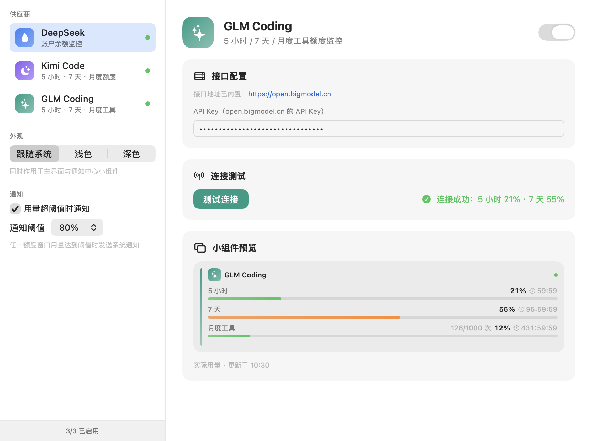
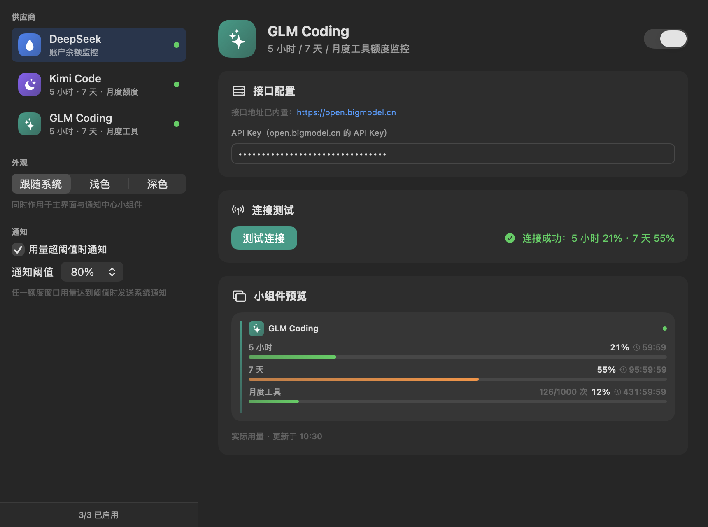
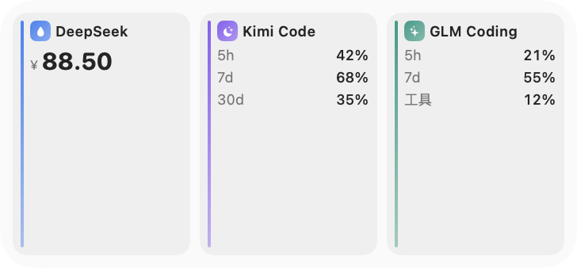
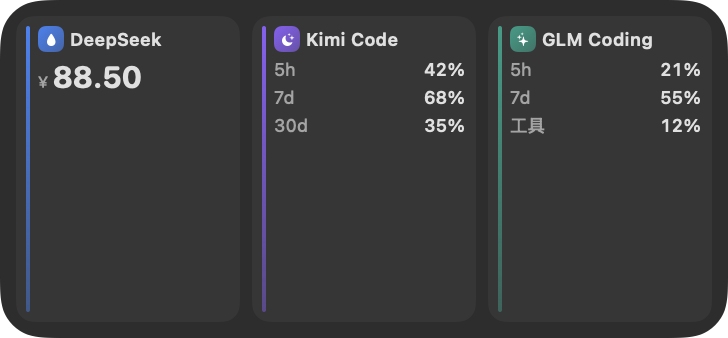
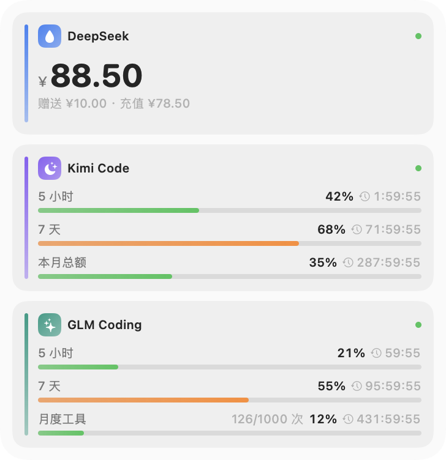

# AITokenUsageWidget

**AI Token Usage Monitor Widget for macOS Notification Center**

Monitor DeepSeek / Kimi (Moonshot AI) / GLM (Zhipu) API balance & quota usage right from your macOS Notification Center — with dark/light themes, threshold alerts, and a live in-app preview.

[中文文档](README.md)

## Screenshots

| Main Window (Light) | Main Window (Dark) |
|---|---|
|  |  |

| Widget · Medium (compact 3-column) | Widget · Dark |
|---|---|
|  |  |

| Widget · Large |
|---|
|  |

## Features

- **Multi-provider monitoring**

  | Provider | Metrics | Data Source |
  |---|---|---|
  | **DeepSeek** | Balance (total / granted / topped-up + availability) | `GET api.deepseek.com/user/balance` |
  | **Kimi Code** | 5-hour / 7-day / monthly quota with reset countdown | `GET api.kimi.com/coding/v1/usages` (monthly needs optional cookie) |
  | **GLM Coding (Zhipu)** | 5-hour / 7-day / 30-day cumulative / monthly tool quota | `open.bigmodel.cn` quota/limit + model-usage (no cookie needed) |

- **Adaptive layout**: only enabled providers are shown; medium widget auto-switches to a compact 3-column layout with 3 providers; medium & large sizes supported
- **Theme switching**: system / light / dark, applied to both the app and the widget
- **Usage alerts**: system notification when any quota window crosses a configurable threshold (50%–95%, default 80%); auto-resets after usage drops
- **Live widget preview**: in-app preview shows mock data (with badge) before configuration and real usage afterwards
- **Auto-saved config**: shared with the widget via App Group; usage queries consume no model tokens
- **15-minute auto refresh** (system-scheduled) with cache fallback

## Tech Stack

- **Swift 5.9 + SwiftUI** — shared view components between app and widget
- **WidgetKit** — `TimelineProvider` + `StaticConfiguration` (systemMedium / systemLarge)
- **App Group / shared JSON** — config sharing (automatic fallback to a container-shared file when no provisioning profile is available)
- **UserNotifications** — alerts sent directly by the widget extension; the app doesn't need to stay running
- **XcodeGen** — declarative project definition (`project.yml`)
- Zero third-party dependencies

## Requirements

- macOS 12.7+ (widget background theming requires macOS 14+)
- Universal binary: Intel & Apple Silicon
- Building from source: Xcode 15+ and [XcodeGen](https://github.com/yonsm/XcodeGen) (`brew install xcodegen`)

## Installation

### Prebuilt

1. Download `AITokenUsageWidget-v1.0-universal.zip` from [Releases](../../releases), unzip, and drag `AITokenUsageWidget.app` into `/Applications`
2. If Gatekeeper blocks the first launch, run once (or click "Open Anyway" in System Settings → Privacy & Security):

   ```bash
   xattr -dr com.apple.quarantine /Applications/AITokenUsageWidget.app
   ```

### Build from Source

```bash
git clone https://github.com/<your-name>/AITokenUsageWidget.git
cd AITokenUsageWidget
./setup.sh        # installs xcodegen, generates & opens the Xcode project
```

Select your Team for both targets (Signing & Capabilities — a free personal certificate works), make sure App Groups `group.com.chenxing.tokenusage` is checked, then run `AITokenUsageWidget`.

> Note: `*.xcodeproj` is generated by XcodeGen and git-ignored — run `./setup.sh` once after cloning.

## Usage

1. **Get API keys**
   - DeepSeek: [platform.deepseek.com](https://platform.deepseek.com) → API Keys (`sk-xxx`)
   - Kimi Code: [kimi.com/code/console](https://www.kimi.com/code/console) (`sk-kimi-xxx`; not interchangeable with the pay-as-you-go platform keys)
   - GLM: API key from [open.bigmodel.cn](https://open.bigmodel.cn)
2. **Configure**: open the app → pick a provider → enable it → paste the API key (auto-saved) → optionally "Test Connection"
3. **Add the widget**: Notification Center → Edit Widgets → add "AI 模型用量" (macOS doesn't allow apps to add widgets automatically)
4. **Optional**: sidebar "外观" for theme, "通知" for alert toggle & threshold; Kimi monthly quota needs an extra `kimi-auth` web cookie (unofficial API)

## Data & Privacy

- API keys stay on device (App Group UserDefaults; falls back to a `shared.json` inside the widget container) and are only sent to the provider's official endpoints
- Storage safety: field-tolerant decoding + `.bak` backup before every write + `shared.corrupt-*.json` preservation on decode failure — config never gets wiped by upgrades
- No telemetry, no third-party analytics

## Adding a Provider

1. Add a case in `Shared/Models/ProviderKind.swift` (name, endpoint, icon, key hint)
2. Add a fetch/parse branch in `Shared/Networking/UsageServices.swift` → `fetch(config:)`
3. Settings UI, storage and widget cards adapt automatically

## Contributing

Issues and PRs are welcome:

1. Fork and create a feature branch (`git checkout -b feature/xxx`)
2. Follow the existing code style (SwiftUI, minimal diffs)
3. Make sure both targets build (Debug + Release) after `xcodegen generate`
4. For new providers, include API documentation links
5. Describe the motivation and attach screenshots for UI changes

**Never commit**: real API keys/cookies, `build/`, `dist/`, `*.xcodeproj` (all covered by `.gitignore`).

## License

[MIT](LICENSE)

## Keywords

`macOS widget` `Notification Center` `WidgetKit` `SwiftUI` `DeepSeek` `Kimi` `Moonshot AI` `GLM` `ChatGLM` `Zhipu AI` `token usage` `API quota` `balance monitor` `usage alerts`
